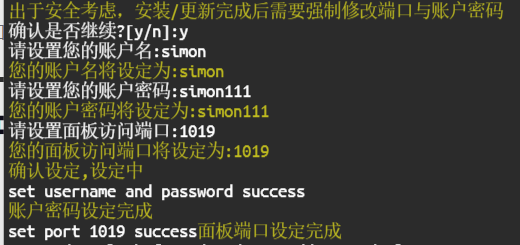

> ## 准备工作
> 1. 域名
> 2. VPS (位于海外)
> 3. 注册Cloudfare账号

## 1. 域名购买申请
可以通过[Namesilo](https://www.namesilo.com/)等类似的平台去购买.

购买完成之后,将域名解析到Cloudfare, 并添加A记录

## 2.购买部署VPS

VPS的选购尽量避免国人客户过多的服务商, IP极易被墙; 例如:hostwind, vultr等都被用烂了

一般VPS服务商都会有 供测试的IP, 可以在 [ping.pe](https://ping.pe/) 测试一下
 
只做流量转发的话VPS的配置不需要很高, 最低配置即可.



### 2.1 配置VPS  

> 本文以centos7为例


通过SSH连接VPS之后,复制下方命令 更新组件
```
yum update -y && yum update -y && yum install -y socat
```
安装X-UI面板
```
bash <(curl -Ls https://raw.githubusercontent.com/vaxilu/x-ui/master/install.sh)
```
安装过程会提示创建账号,密码及端口, 按提示操作即可




### 2.2 登录x-ui
安装完成之后登录面板 在浏览器输入(VPS的IP:端口)(例如:<kbd>252.16.12.15:1019</kbd>)


输入刚刚设置的账号与密码登录,就会看到如下界面


### 2.3 申请SSL证书
>此步骤需要你的
> * Cloudfare账号和Global Key(可在Cloudfare的DNS页面找到)
> 
控制台输入<kbd>x-ui</kbd>

输入<kbd>16.运行一键申请SSL证书</kbd>按照提示操作即可.

自动安装完成之后你会得到两个文件

<kbd>xxxx.cer</kbd>
<kbd>xxxx.key</kbd> 

并存放在```/root/cert```(可能会略有不同,可在控制台的输出结果,查看证书安放位置)

选择面板设置,将得到的公钥和key的存放地址放入下图的红框位置


保存配置, 重启面板

### 2.3 添加入站协议
>这一步需要你的域名在Cloudfare解析完毕. 可通过CMD的ping测试
>```
>ping xxx.dxxxdxxx.top 
>#如果ping的结果包含你的VPS IP地址, 即代表解析成功```

点击<kbd>入站列表</kbd>的<kbd>**+**</kbd>号. 添加入站协议,
我这里选择的协议是<kbd>Vless+ws+tls</kbd>如下图, 可根据情况进行调整


这里公钥和密钥的路径,同上一步的路径一直


点击, 添加, 并启用.

到这里一个基于<kbd>Vless+ws+tls</kbd>的节点创建完成, 你可以通过二维码或者在详细信息里复制链接
将节点添加至你的小飞机, openclash, v2ray等等支持vless协议的软件里



若发现节点不可用, 请先检查VPS的防火墙是否放行节点的端口
